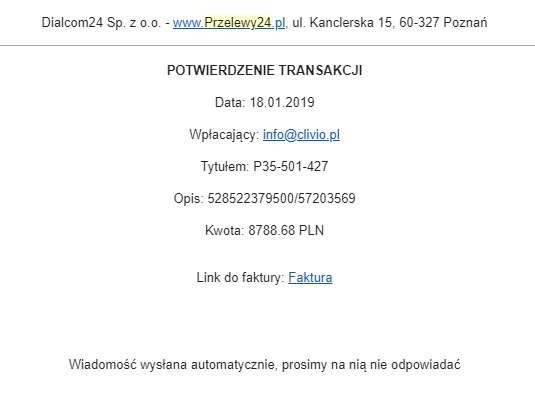

# Bezpieczeństwo poczty elektronicznej

Obecnie w Polsce dominują oszustwa komputerowe (raport CERT Polska 2025), a poczta elektroniczna to jedno z najczęstszych miejsc ataków na pracowników.

## Rozpoznawanie zagrożeń i środki ostrożności

Jakie zasady cyberhigieny należy bezwzględnie zachować?

1. Nie należy używać prywatnych kont czy urządzeń w celach służbowych.
2. Nie należy używać służbowych urządzeń w celach prywatnych. Nie wolno również umożliwiać dostępu do nich osobom trzecim, nawet najbliższej rodzinie.
3. Zawsze należy dokładnie sprawdzać, czy domena w adresie e-mail nadawcy jest prawidłowa.
   > Nigdy nie otwieraj załączników od nieznanych nadawców, nawet jeśli w tytule maila widnieje słowo "Faktura" lub "Wezwanie do zapłaty"!
4. Nigdy nie należy podawać nikomu swojego hasła.
5. Należy stosować trudne do odgadnięcia hasła:
   Konkretne wytyczne znajdziesz w [Polityce zarządzania hasłami](hasla.md).
6. Warto włączyć uwierzytelnianie dwuskładnikowe (MFA).
7. Należy pamiętać o posiadaniu zaktualizowanego programu antywirusowego.
8. W przypadku otrzymania podejrzanej wiadomości należy niezwłocznie zgłosić ją administratorowi systemu lub działowi IT.

## Przykłady - jak może wyglądać atak

Najczęstsze techniki stosowane przez cyberprzestępców to:
- **Phishing standardowy:** Masowo wysyłane wiadomości udające banki, firmy kurierskie lub dostawców usług (np. fałszywa faktura za prąd).
- **Spear-phishing:** Atak precyzyjnie wycelowany w konkretną osobę w firmie. Przestępca wcześniej bada ofiarę (np.: na LinkedIn), by mail brzmiał maksymalnie wiarygodnie.
- **BEC (Business Email Compromise):** Przejęcie konta członka zarządu i rozsyłanie z niego próśb do księgowości o pilne wykonanie "poufnego przelewu" na nowe konto.

Poniżej znajduje się przykład e-maila phishingowego:
> *Phishing to metoda oszustwa, w której przestępca podszywa się pod inną osobę lub instytucję w celu wyłudzenia poufnych informacji.*

> *Źródło: CLIVO.PL*

Z pozoru nieszkodliwy, zwyczajny, wyglądający całkowicie normalnie e-mail, tak naprawdę pochodzi z innego, złego adresu!

## Kliknąłeś w podejrzany link? Co teraz?
**Jeśli podejrzewasz, że Twój e-mail padł ofiarą ataku, każda sekunda ma znaczenie. Sprawdź jak postępować w zakładce: [Zarządzanie incydentami bezpieczeństwa](incydenty.md).**

