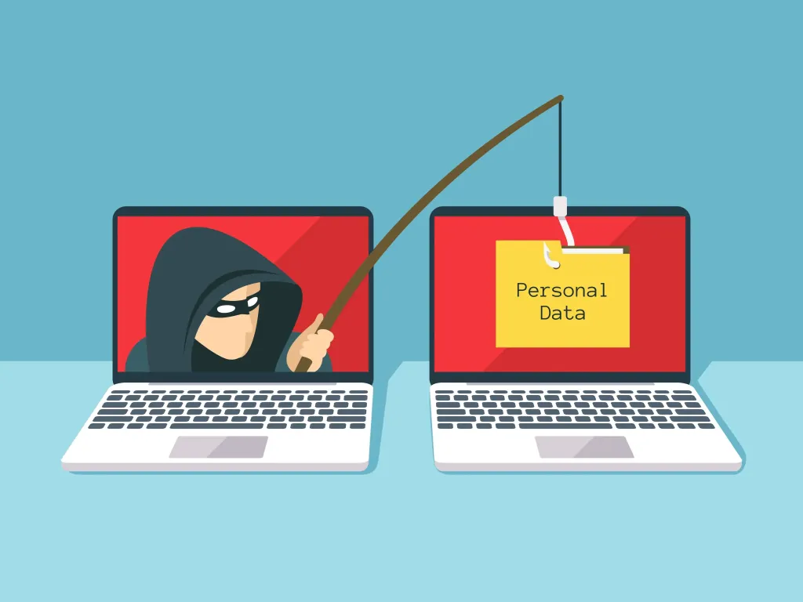

# Dobre praktyki bezpieczeństwa

## Wprowadzenie

Nawet najlepsze zabezpieczenia techniczne nie pomogą, jeśli użytkownicy nie będą ich przestrzegać. Większość incydentów bezpieczeństwa wynika z błędów ludzi. Poniżej przedstawiono najważniejsze dobre praktyki.

## Zasada minimalnych uprawnień

Każdy pracownik powinien mieć dostęp tylko do tego, co jest mu potrzebne do pracy:

- nie korzystać z konta administratora do codziennych zadań,
- przy zmianie stanowiska zaktualizować uprawnienia,
- niepotrzebne dostępy powinny być odbierane.

## Rozpoznawanie phishingu

Zanim klikniesz w link lub otworzysz załącznik, sprawdź:

- czy adres nadawcy jest prawidłowy (np. `firma.pl` a nie `flrma.pl`),
- czy wiadomość nie wywiera presji (np. "musisz kliknąć w 5 minut"),
- czy załącznik nie ma podejrzanego rozszerzenia (np. `faktura.pdf.exe`),
- najedź kursorem na link, żeby zobaczyć prawdziwy adres.

## Bezpieczne korzystanie z Internetu

- sprawdzać, czy strona ma HTTPS (kłódka w pasku adresu) przed logowaniem,
- nie pobierać programów z nieoficjalnych stron,
- nie klikać w podejrzane reklamy i wyskakujące okna.

## Bezpieczeństwo telefonu służbowego

- zabezpieczyć telefon PIN-em lub odciskiem palca,
- włączyć szyfrowanie pamięci,
- instalować aplikacje tylko z oficjalnego sklepu,
- włączyć możliwość zdalnego wymazania danych w razie kradzieży.

## Co robić w razie incydentu

1. Nie panikować.
2. Odłączyć komputer od sieci (wyciągnąć kabel lub wyłączyć Wi-Fi).
3. Nie wyłączać komputera.
4. Zgłosić sytuację do działu IT.
5. Zapisać, co się stało.

## Przykłady

### Przykład 1: Praca zdalna — dobre vs złe praktyki

| Zła praktyka | Dobra praktyka |
|---|---|
| Praca na komputerze rodzinnym | Osobny komputer służbowy |
| Wi-Fi w kawiarni bez VPN | Zawsze łączyć się przez VPN |
| Laptop zostawiony w aucie | Laptop zawsze przy sobie |

### Przykład 2: Podejrzany e-mail

Pracownik dostaje e-mail "Pilne — zmień hasło" od `it-support@flrma.pl`. Adres ma literówkę (brak litery "i" w "firma").

**Co zrobić:**

1. Nie klikać w link.
2. Zgłosić wiadomość do działu IT.
3. Usunąć e-mail.
